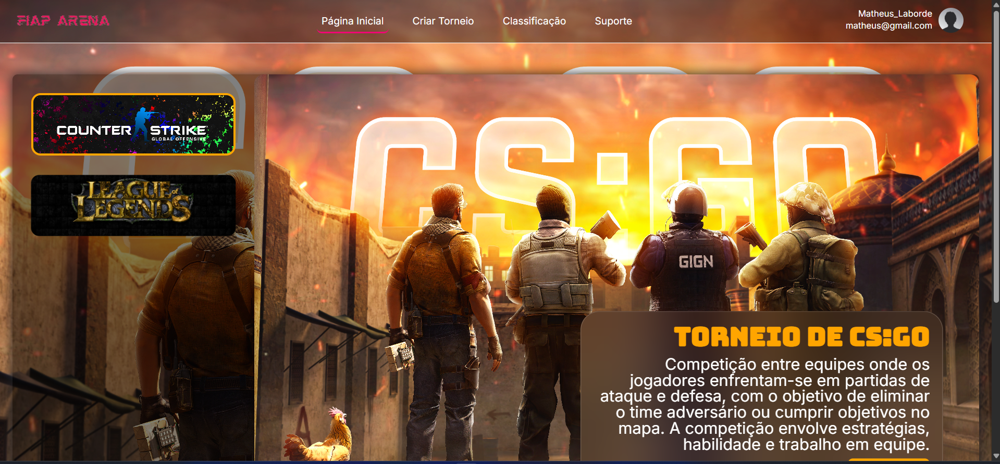
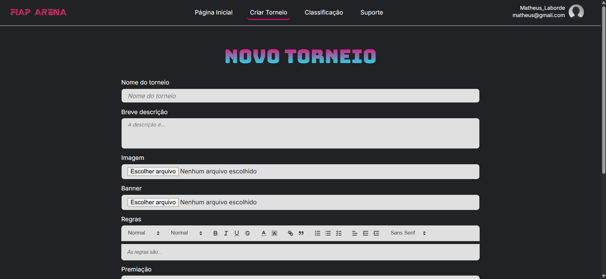
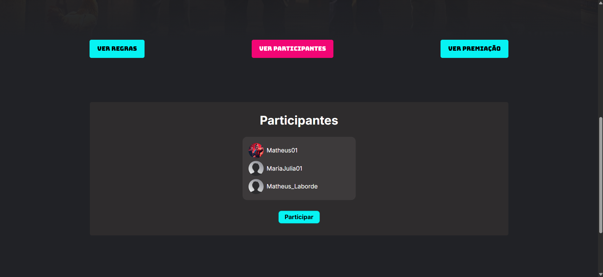
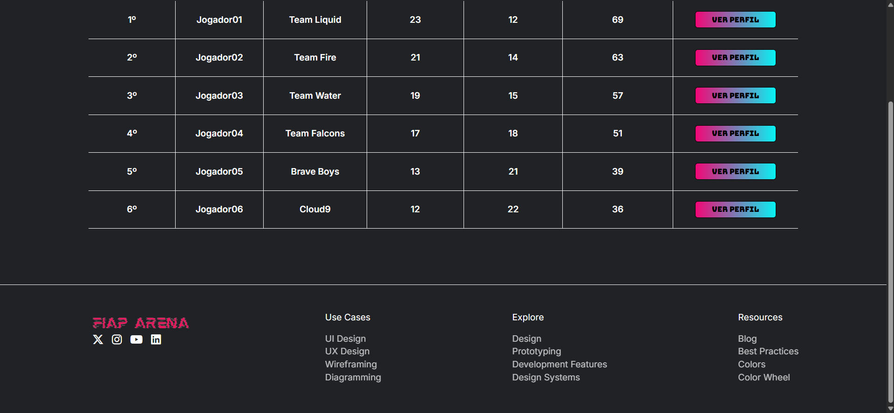

# 🏆🎮 FIAP ARENA – Plataforma de Torneios Digitais

## 🗒️ Sobre o projeto

**FIAP ARENA** é uma plataforma web desenvolvida para a criação e gestão de torneios de jogos digitais, destinada a alunos e professores. O projeto tem como objetivo fortalecer o engajamento, a socialização e a colaboração no ambiente educacional por meio de competições recreativas.

Mais do que apenas uma ferramenta de entretenimento, a FIAP ARENA pode ser utilizada de forma pedagógica. Professores têm a possibilidade de criar jogos e desafios com conteúdos relacionados à tecnologia, incentivando os alunos a aprenderem de forma prática, lúdica e interativa.

O sistema foi desenvolvido com foco em segurança cibernética, utilizando boas práticas de desenvolvimento web para garantir uma experiência segura e acessível para todos os usuários.

---

## 🖼️ Imagens do projeto

### Página Login


### Página Criar Conta


### Página Inicial


### Página Criar Torneio


### Página Descrição Torneio


### Página Ranking


---

## ⚙️ Funcionalidades

- Criação e gerenciamento de torneios e jogos digitais;
- Cadastro e autenticação segura de usuários;
- Interface intuitiva e responsiva;
- Possibilidade de utilização dos jogos como ferramenta de ensino.

---

## 🛠️ Tecnologias Utilizadas

### Front-end
- **HTML** e **CSS**: Estruturação e estilização das páginas;
- **JavaScript**: Funcionalidades interativas;
- **UX/UI Design**: Navegação intuitiva e design responsivo.

### Back-end
- **PHP**: Lógica de negócio e integração com o banco de dados;
- **MySQL**: Gerenciamento de dados da aplicação.

### Controle de Versão
- **Git** e **GitHub**: Controle de versão e colaboração em equipe.

---

## 🔐 Segurança Cibernética

O desenvolvimento da FIAP ARENA seguiu práticas essenciais de segurança web, incluindo:

- Validação de dados de entrada para evitar ataques maliciosos;
- Hash seguro para armazenamento de senhas;
- Prevenção contra SQL Injection;
- Aplicação de medidas adicionais de segurança com mentoria técnica da **Palo Alto Networks**.

---

## ▶️ Como Executar o Projeto

### Pré-requisitos

- PHP (versão 7.4 ou superior);
- MySQL;
- Ambiente de servidor local como **XAMPP**, **WAMP** ou **MAMP**;
- Navegador atualizado.

### Passo a Passo

1. Clone o repositório:
   ```bash
   git clone https://github.com/MathLaborde/FiapArena.git

2. Mova os arquivos para a pasta do seu servidor local (exemplo: htdocs no XAMPP).

3. Abra o XAMPP e dê 'start' no Apache e MySQL.

4. Importe o banco de dados:
    - Acesse o phpMyAdmin;
    - Crie um banco de dados chamado fiap_arena;
    - Importe o arquivo fiaparena.sql localizado no repositório.

5. Configure os parâmetros de conexão com o banco de dados no arquivo config.php (ou equivalente).

6. Inicie o servidor local (Apache e MySQL).

7. No navegador, acesse:
   ```bash
   http://localhost/FiapArena

8. Obs: temos um arquivo chamado torneios.txt dentro do repositório para ajudar na criação de alguns torneios, para realização de testes.

---

## 🧠 Aprendizados

Durante o desenvolvimento deste projeto, os integrantes da equipe aprofundaram conhecimentos em:

- Desenvolvimento web full stack (Front-end e Back-end);
- Boas práticas de segurança da informação;
- Controle de versão com Git e GitHub;
- Melhoria de experiência do usuário (UX/UI);
- Integração de ferramentas de cibersegurança.

---

## 👨‍💻 Equipe

Projeto desenvolvido por alunos da **FIAP** no módulo de **CyberSecurity & GameWeb**.

---

📌 *Este projeto é acadêmico e foi desenvolvido com fins educacionais.*

